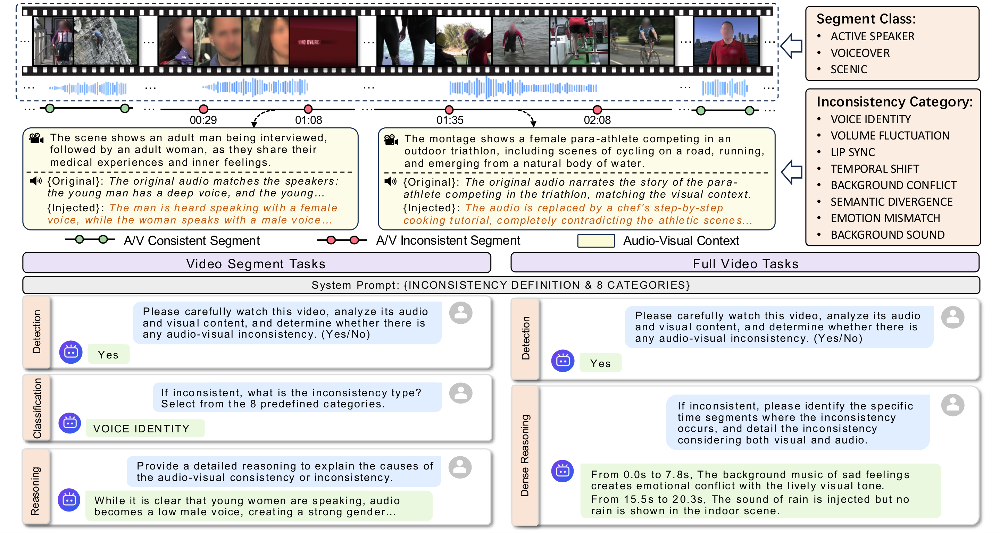
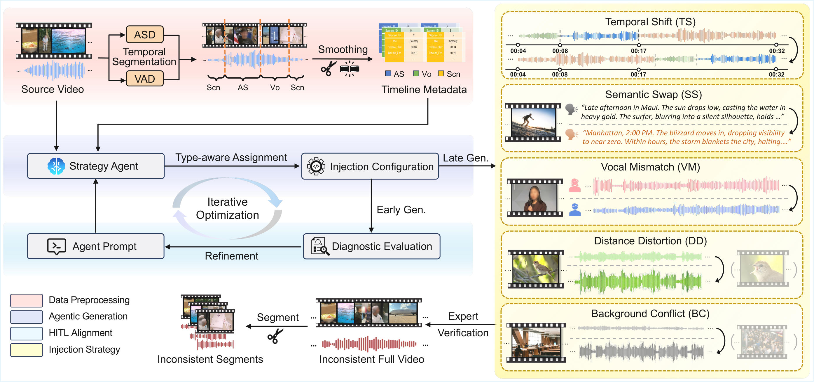
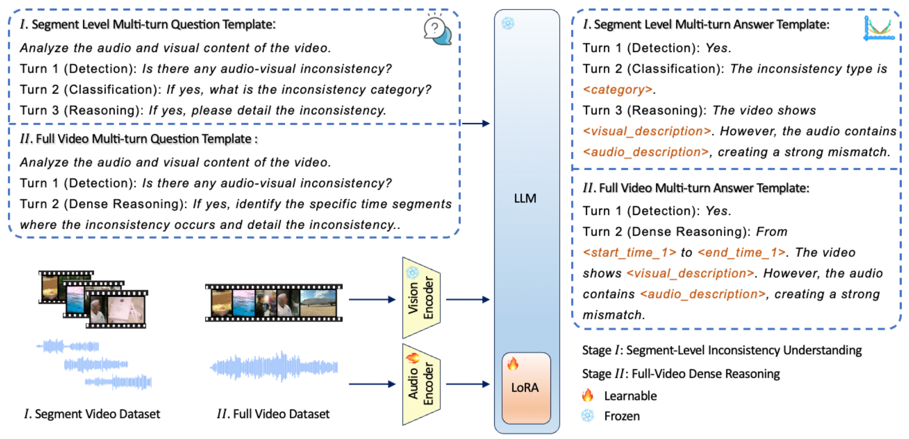

<div align="center">

# AVID-Bench

### Benchmarking Audio-Visual Inconsistency Understanding for Omni-Modal Language Models

[](https://arxiv.org/abs/2604.13593)
[](https://modelscope.cn/datasets/czx13927247324/AVID)
[](LICENSE)

[Zixuan Chen](),
[Depeng Wang](),
[Hao Lin](),
[Li Luo](),
[Ke Xu](),
[Ya Guo](),
[Huijia Zhu](),
[Tanfeng Sun](),
[Xinghao Jiang]()\*

_Shanghai Jiao Tong University, Ant Group_

(\* Corresponding Author)



</div>

## Overview

**AVID** is the first large-scale benchmark for evaluating omni-modal LLMs on **audio-visual inconsistency understanding** in videos. It features **11.2K long-form videos** (avg. 235.5s) with **39.4K annotated inconsistency events** and **78.7K segment clips**, supporting evaluation across detection, temporal grounding, classification, and reasoning over **8 fine-grained inconsistency categories**.

<div align="center">

</div>

### Highlights

- **8 Inconsistency Categories** across 3 segment classes (Active Speaker, Voiceover, Scenic)
- **2-Level Evaluation**: Segment-level detection & Full-video temporal grounding
- **AVID-Qwen**: Fine-tuned baseline surpassing Gemini 3.1 Pro (mIoU: 36.1% vs. 26.2%, SODA-m: 7.47 vs. 5.83)

## News

- **[2026/06]** Code and dataset released!
- **[2026/04]** Paper available on [arXiv](https://arxiv.org/abs/2604.13593).

---

## Getting Started

### 1. Installation

```bash
git clone https://github.com/czx1220/AVID-bench.git
cd AVID-bench
pip install -r requirements.txt
```

### 2. Download Dataset

The full dataset is hosted on [HuggingFace](https://huggingface.co/datasets/czx1220/AVID-Bench).

```bash
pip install -U huggingface_hub

# Download annotations only (~61MB, recommended to start)
huggingface-cli download czx1220/AVID-Bench --repo-type dataset \
    --include "annotations/*" --local-dir ./data

# Download test set videos (~84GB)
huggingface-cli download czx1220/AVID-Bench --repo-type dataset \
    --include "test_1171/*" "test_1171_segments/*" --local-dir ./data

# Download full dataset (~415GB, including training set)
huggingface-cli download czx1220/AVID-Bench --repo-type dataset --local-dir ./data
```

### 3. Data Layout

After downloading, your directory should look like:

```
AVID-bench/
├── data/
│   ├── annotations/
│   │   ├── test_fullvideo.jsonl        # Full-video evaluation (1,561 samples)
│   │   ├── test_segments.jsonl         # Segment-level evaluation (10,634 samples)
│   │   ├── avid_dvc_test.jsonl         # Dense Video Captioning (1,171 queries)
│   │   ├── avid_tvg_test.jsonl         # Temporal Video Grounding (5,317 queries)
│   │   ├── train_fullvideo.jsonl       # Training: full-video (9,652 samples)
│   │   └── train_segments.jsonl        # Training: segments (43,777 samples)
│   ├── test_1171/                      # Full test videos (57GB)
│   ├── test_1171_segments/             # Test video segments (27GB)
│   │   ├── negative/
│   │   └── positive/
│   ├── train_7239/                     # Full training videos (205GB)
│   └── train_7239_segments/            # Training video segments (126GB)
│       ├── negative/
│       └── positive/
├── evaluation/
└── training/
```

All `video_path` fields in annotation files are relative to the `data/` directory.

---

## Evaluation

We provide evaluation scripts for two levels:

### Segment-Level Evaluation

**Step 1: Run inference** on test segments using your model (see `evaluation/segment/test_model_qwen3omni_batch.py` as a reference):

```bash
python evaluation/segment/test_model_qwen3omni_batch.py \
    --qa-dir ./data/annotations \
    --output-dir ./results/segment/your_model \
    --batch-size 16
```

Each result file (`{qa_id}_result.json`) should contain:
```json
{
  "qa_id": "neg_VIDEO_ID_0",
  "ground_truth": {"exists": "Yes", "injection_type": "...", "inconsistency_point": "..."},
  "model_answer": "...",
  "parsed_answer": {"exists": "Yes", "injection_type": "...", "inconsistency_point": "..."},
  "exists_correct": true,
  "injection_type_correct": true,
  "rouge_l_score": 45.2,
  "meteor_score": 38.1,
  "bleu4_score": 12.5
}
```

**Step 2: Compute metrics**:

```bash
# Detection accuracy, classification accuracy, ROUGE-L, METEOR, BLEU-4
python evaluation/segment/eval_statistics.py --results_dir ./results/segment/your_model

# Sentence cosine similarity
python evaluation/segment/eval_sentence_cosine.py --results_dir ./results/segment/your_model
```

### Full-Video Evaluation

**Step 1: Run inference** on full test videos (see `evaluation/fullvideo/test_model_qwen3omni.py`):

```bash
python evaluation/fullvideo/test_model_qwen3omni.py \
    --video ./data/test_1171/VIDEO_ID_injected.mp4
```

**Step 2: Compute metrics**:

```bash
# Recall@IoU (0.3/0.5/0.7), mIoU
python evaluation/fullvideo/eval_iou.py --results_dir ./results/fullvideo/your_model

# Detection accuracy, classification accuracy
python evaluation/fullvideo/eval_statistics.py --results_dir ./results/fullvideo/your_model

# Sentence cosine similarity (SODA-m)
python evaluation/fullvideo/eval_sentence_cosine.py --results_dir ./results/fullvideo/your_model
```

### Metrics

| Level | Metrics |
|-------|---------|
| Segment | Accuracy, Classification Acc, BLEU-4, ROUGE-L, METEOR, Cosine Sim |
| Full-video | Recall@IoU (0.3/0.5/0.7), mIoU, SODA-m, Classification Acc |

See `evaluation/*/example_results/` for reference output format from different models.

---

## Training (AVID-Qwen)

<div align="center">

</div>

We fine-tune Qwen3-Omni via two-stage LoRA using [SWIFT](https://github.com/modelscope/swift):

### Stage 1: Segment-Level SFT

```bash
bash training/sft_stage1_segment.sh
```

### Stage 2: Full-Video SFT

```bash
bash training/sft_stage2_fullvideo.sh
```

### Merge LoRA Weights

```bash
bash training/merge_lora.sh
```

**Config**: LoRA rank=8, alpha=32, lr=1e-4, DeepSpeed ZeRO-3, 6×A100 80GB

> Note: Modify `--dataset` paths in the shell scripts to point to your local data directory.

---

## Citation

If you find this work helpful, please cite our paper:

```bibtex
@inproceedings{chen2026avid,
  title={AVID: Benchmarking Audio-Visual Inconsistency Understanding for Omni-Modal Language Models},
  author={Chen, Zixuan and Wang, Depeng and Lin, Hao and Luo, Li and Xu, Ke and Guo, Ya and Zhu, Huijia and Sun, Tanfeng and Jiang, Xinghao},
  booktitle={Proceedings of the 2026 Conference on Empirical Methods in Natural Language Processing (EMNLP)},
  year={2026}
}
```

## License

This project is released under the [Apache 2.0 License](LICENSE).
